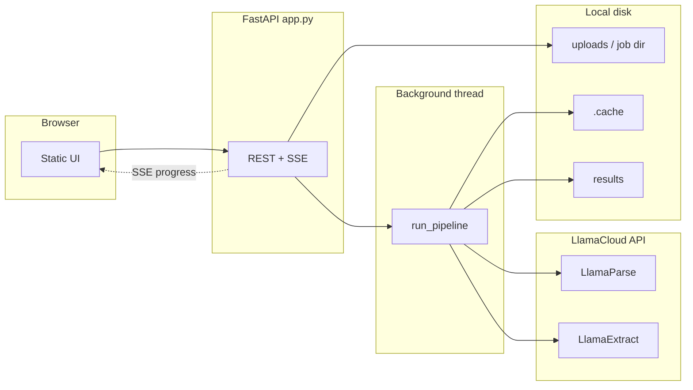

# How the FRY9C extraction app works

This document explains the **end-to-end flow**: what runs when you upload PDFs (or start a job from project files), how **LlamaCloud** is used, where **caching** applies, and what lands on disk.

---

## 1. What the system does (one sentence)

The app takes two PDFs—the **FR Y-9C Form** and **Instructions**—turns each page into text with **LlamaParse**, **groups pages by schedule** (e.g. Schedule HI, HC-B), runs **LlamaExtract** on each schedule PDF with JSON schemas, then **matches** form line items to instruction text and writes **combined JSON** per schedule.

---

## 2. Architecture at a glance

- **FastAPI** (`app.py`) accepts uploads or default project PDFs, copies them into a **job folder** under `results/<job_id>/`, and starts the pipeline in a **daemon thread** so HTTP requests return immediately with a `job_id`.
- **Progress** is sent to the browser with **Server-Sent Events (SSE)** on `GET /api/jobs/{job_id}/stream`. Each step of the pipeline emits a `ProgressEvent` (step number, message, percentage, structured `detail`).
- The pipeline logic lives in **`pipeline/processor.py`** (`run_pipeline`). LlamaCloud calls are implemented in **`pipeline/extractor.py`**.

---

## 3. Request lifecycle (web layer)

| Action | What happens |
|--------|----------------|
| `POST /api/upload` | Saves `form_*.pdf` and `instr_*.pdf` under `results/<job_id>/`, registers the job for SSE, starts `run_pipeline` in a thread. |
| `POST /api/start-default` | Same, but copies **project root** PDFs (e.g. `FR_Y-9C*_f.pdf` / `*_i.pdf`) if present. |
| `GET /api/jobs/{job_id}/stream` | Long-lived HTTP response; server pushes JSON events as the pipeline runs. |
| `GET /api/jobs/{job_id}/status` | Same events as a JSON array (polling fallback). |
| `GET /api/jobs/{job_id}/results` | Reads `index.json` after the job finishes. |
| `GET /` | Serves the static single-page UI from `static/`. |

**Why a thread?** The pipeline can run for many minutes (many schedules × LlamaCloud). The server must stay responsive; SSE subscribers wait on an `asyncio.Event` that the worker thread signals when a new progress line is appended.

---

## 4. The five pipeline steps

All logic is in **`run_pipeline(job_dir, form_pdf, instr_pdf, on_progress=...)`**.

### Step 1 — Parse (LlamaParse)

- **Input:** Full Form PDF, then full Instruction PDF.
- **Service:** LlamaCloud **parsing** API (`AsyncLlamaCloud.parsing.parse`), default tier **`agentic`** (override with `FRY9C_PARSE_TIER`).
- **Output:** One text blob per document. Pages are concatenated with a separator (`\n\n---\n\n`) so the splitter can treat each page independently.
- **Cache:** Under `.cache/parse/`, keyed by **file hash + parse options** (tier, version, Azure-related fingerprint). Re-running the same PDF with the same options skips the API call.

### Step 2 — Split (schedule detection + PDF slicing)

- **Input:** Parsed text from step 1; original PDF bytes from disk.
- **Logic:** `pipeline/splitter.py` classifies **each page** into a schedule label (e.g. `Schedule_HI`, `Schedule_HC-B`) or special buckets like `Cover`, `Unclassified`.
- **Modes:** `FRY9C_SPLIT_MODE=hybrid` (default: header region + footer patterns) or `footer_only` (package-style footers only).
- **Output:** Subfolders under `job_dir/splits/` with one small PDF per schedule for **form** and **instruction** sides (`form_splits/`, `instr_splits/`).

### Step 3 — Extract forms (LlamaExtract)

- **Input:** Each per-schedule Form PDF + JSON schema `schemas/form_line_item_schema.json`.
- **Service:** LlamaCloud **extraction** API (`AsyncLlamaCloud.extraction.extract`) with a schema that describes each **line item** (reference number, description, MDRM fields, etc.).
- **Concurrency:** All schedules are submitted in **one batch** (`asyncio.gather`) for throughput.
- **Skip:** Pages labeled **`Unclassified`** are not sent to extraction (saves credits); the UI gets a warning-style progress message.
- **Cache:** Under `.cache/extract/`, keyed by **PDF hash + schema hash + extract config fingerprint**.

### Step 4 — Extract instructions (LlamaExtract)

- Same pattern as step 3, using `schemas/instruction_line_item_schema.json` on **instruction** schedule PDFs.

### Step 5 — Match

- **Input:** Extracted rows from form vs instruction for the same schedule name.
- **Logic:** `pipeline/matcher.py` **normalizes** line reference strings (form vs instruction formatting can differ) and joins records; optional **parent** fallback when a sub-line has no direct instruction row.
- **Output:** Per-schedule combined JSON under `results/<job_id>/results/`, plus `index.json` summarizing the job.

---

## 5. LlamaExtract configuration (how the model is chosen)

Settings are centralized in **`pipeline/extract_settings.py`** and summarized in **`.env.example`**.

Rough resolution order:

1. **`LLAMA_EXTRACT_MODEL`** — explicit deployment name or LlamaCloud PREMIUM slug.
2. **`AZURE_OPENAI_DEPLOYMENT`** — your Azure OpenAI deployment name.
3. If **`AZURE_OPENAI_ENDPOINT`** and an API key are set but deployment is empty, the app defaults the deployment name to **`gpt-5.4`** (configurable in code as `DEFAULT_AZURE_DEPLOYMENT`).
4. If none of the above apply, a LlamaCloud-hosted fallback slug may be used when **PREMIUM** mode is active.

**Mode:** When Azure credentials (endpoint + key) are present, or a model/deployment is set, extraction typically runs in **PREMIUM** mode so `extract_model` can be set. Otherwise **`LLAMA_EXTRACT_MODE`** defaults to **MULTIMODAL** (see code for exact rules).

Chunking and context are tuned per **kind** (form vs instruction): e.g. **PAGE** vs **SECTION** chunk mode, and `num_pages_context` may vary by schedule class (e.g. wider context for some HC schedules).

---

## 6. Caching (why repeat runs are fast)

| Cache | Location | Invalidates when |
|-------|----------|------------------|
| Parse | `.cache/parse/*.txt` + `.meta.json` | PDF bytes change, or parse tier/version/Azure fingerprint in `pipeline/cache.py` changes |
| Extract | `.cache/extract/*.json` | PDF or schema changes, or extract config fingerprint changes |
| TTL | Optional | `CACHE_MAX_AGE_DAYS` — stale entries are ignored and recomputed |

Caches are **content-addressed** (hashes), not keyed only by filename.

---

## 7. Job folder layout (after a run)

Example: `results/<job_id>/`

- `form_<name>.pdf`, `instr_<name>.pdf` — copies of inputs  
- `splits/` — intermediate split PDFs  
- `status.json` — full list of progress events (audit trail)  
- `index.json` — job summary, schedule list, metadata (e.g. extract model used)  
- `results/` — `*_combined.json` per schedule  

---

## 8. Configuration reference (short)

| Variable | Role |
|----------|------|
| `LLAMA_CLOUD_API_KEY` / `LLAMA_API_KEY` | LlamaCloud API key for parse + extract |
| `AZURE_OPENAI_*` | Azure OpenAI endpoint, key, deployment, API version — drive PREMIUM + deployment defaults |
| `FRY9C_PARSE_TIER` | LlamaParse tier: `agentic`, `cost_effective`, `fast` |
| `FRY9C_SPLIT_MODE` | `hybrid` or `footer_only` |
| `CACHE_MAX_AGE_DAYS` | Optional cache staleness window |

See **`.env.example`** for the full list and comments.

---

## 9. Further reading in the repo

| File | Purpose |
|------|---------|
| `app.py` | HTTP routes, SSE wiring, job enqueue |
| `pipeline/processor.py` | Orchestration, progress events, batch extract calls |
| `pipeline/extractor.py` | LlamaCloud SDK: parse + extract + cache integration |
| `pipeline/extract_settings.py` | Model/mode resolution, extract config dict |
| `pipeline/splitter.py` | Page classification and PDF splitting |
| `pipeline/matcher.py` | Normalization and joining form ↔ instruction |
| `pipeline/cache.py` | Disk cache keys and TTL |
| `schemas/*.json` | JSON schemas passed to LlamaExtract |

---

## 10. Regulatory / audit notes

- Progress is persisted in **`status.json`** per job with timestamps.
- Extract configs can include **confidence** and **citation** flags (see `extract_settings.py`) to support review workflows; outputs should be validated against source PDFs for filing use cases.

If you want this document expanded (sequence diagrams per step, or a field-by-field schema glossary), say what audience you are targeting (developers vs compliance reviewers).
